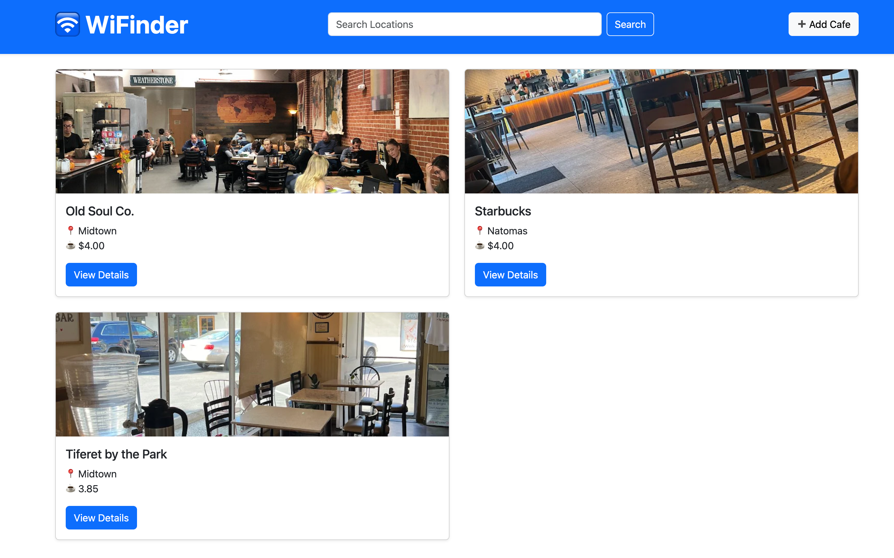

# 🛜 WiFinder

WiFinder is a Flask-based web application that helps users discover and explore local cafes with reliable WiFi. Users can browse a list of cafes, view details, report closed locations, and contribute by adding new cafes.

---

## 🚀 Features

- 🔍 Search cafes by location  
- 📸 View thumbnail images for each cafe  
- 📄 Detailed cafe view with:
  - Seating, WiFi, power outlet availability
  - Coffee pricing
  - Google Maps link  
- ➕ Add a new cafe  
- ✏️ Update existing cafes  
- 🛑 Report closed cafes  

---

## 🛠️ Tech Stack

- **Python** (Flask)  
- **HTML**, **CSS**, **Bootstrap 5**  
- **SQLite** (via SQLAlchemy ORM)  
- **WTForms** for input handling  
- **Jinja2** for template rendering  

---

## 📸 Screenshots



---

## 🧰 Installation & Setup

1. **Clone the repository**

   ```bash
   git clone https://github.com/yourusername/wifinder.git
   cd wifinder
   ```
   
2. **Create a virtual environment**

    ```bash
    python3 -m venv venv
    source venv/bin/activate  # On Windows use "venv\Scripts\activate"
    ```
3. **Install dependencies**

    ```bash
     pip install -r requirements.txt
    ```
4. Run the app

    ```bash
    flask run
   ```

5. Open your browser and visit: [http://localhost:5000](http://localhost:5000)

## ✅ To-Do

- [ ] Add user login/registration  
- [ ] Allow users to leave reviews  
- [ ] Sort/filter cafes by features (e.g. has WiFi, has toilet)  
- [ ] Improve mobile responsiveness  